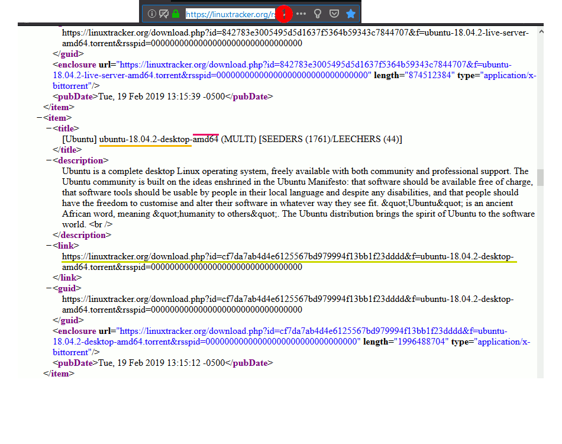

# FlexFX

Alternative to FlexGet.

## Dowload and Run

1. Download from [release area.](https://github.com/dscontrak/FlexFX/releases)
2. Uncompress the file on any folder in your pc.
3. And click on next file to run.

### Run Windows

Click on `javafx-win.bat`

Alternative to run on cmd:

```sh
java -jar FlexFX-1.X.jar
```

### Run Linux / Mac

Click on `javafx-unix.sh`

Alternative to run on terminal:

```sh
chmod +x javafx-unix.sh
./javafx-unix.sh
```

## How to use



1. Find a RSS with links to download
2. Add (`+`) RSS link
3. Put the link and `Get` information the internet.
4. `Save` the information
5. Select the last Rss added
6. Add (`+`) a new filter to RSS
7. Fill the fields (Test all possible combinations) and `Save` the information.
8. Donwload files of the RSS
9. Select one option to open file or download again.
    - 9.1 Open with default program to open torrent file.
    - 9.2 Open with client torrent configured.
    - 9.3 Download again the file if exist error.

### Client bittorrent

In this moement only `qBittorrent 4.2.+` is supported.

## Developed

### Requirements

- Netbeans `8.2.+`
- Maven
- Scene Builder `8.5.+`

### Download and Changes

```sh
git clone https://github.com/dscontrak/FlexFX.git
```

Open folder with Netbeans and do your changes and send a pull request.